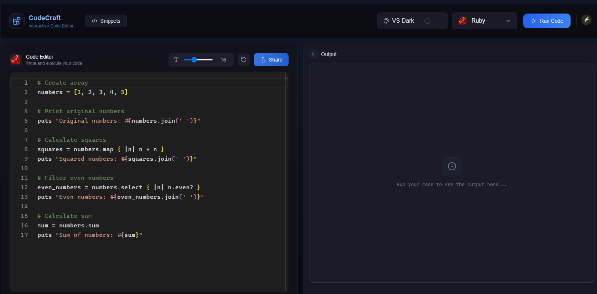
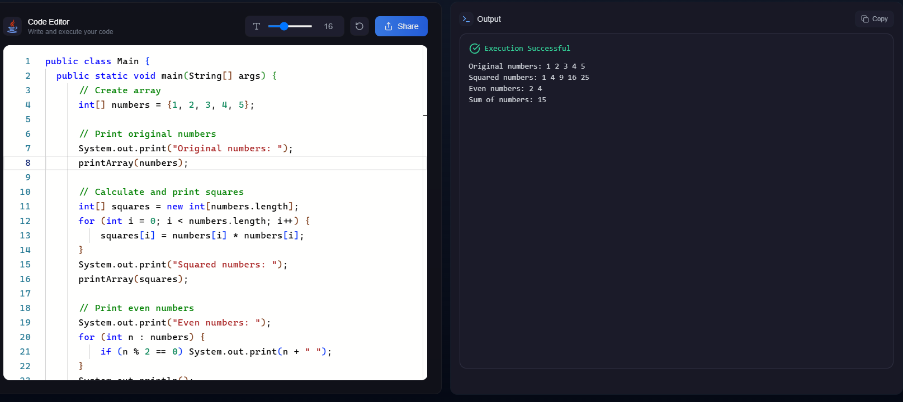
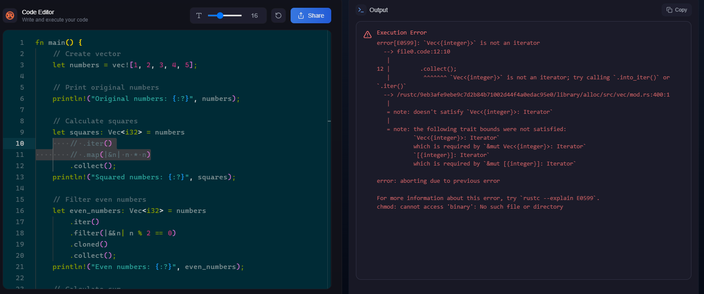
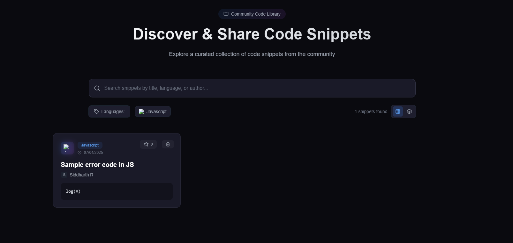
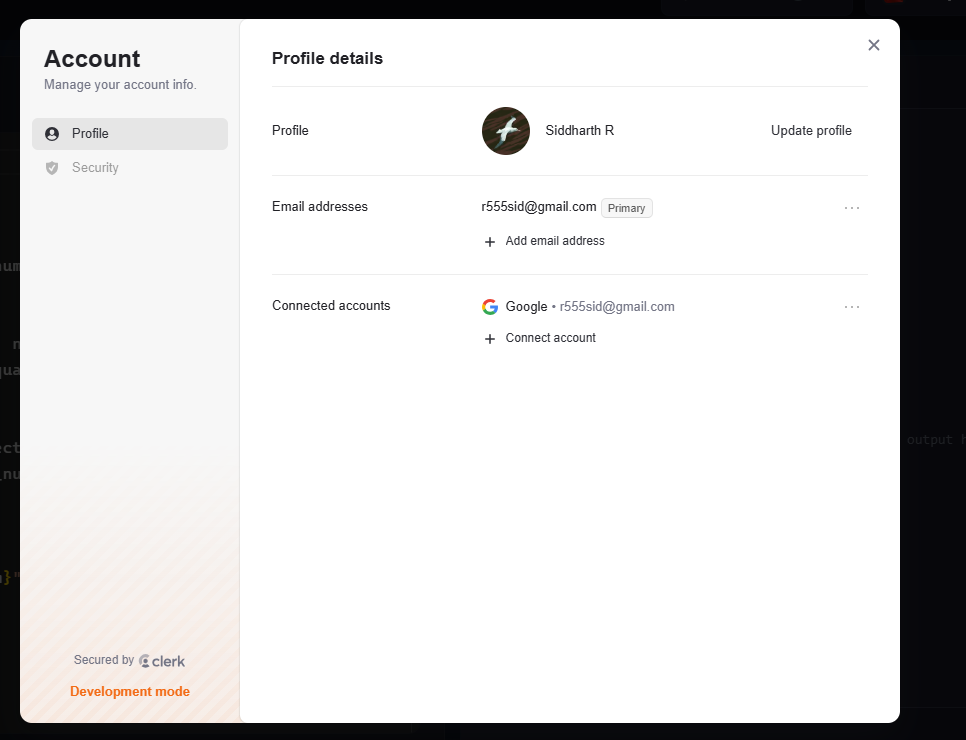
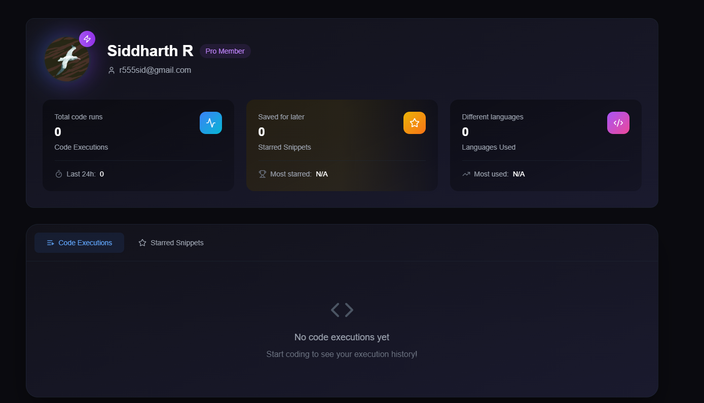
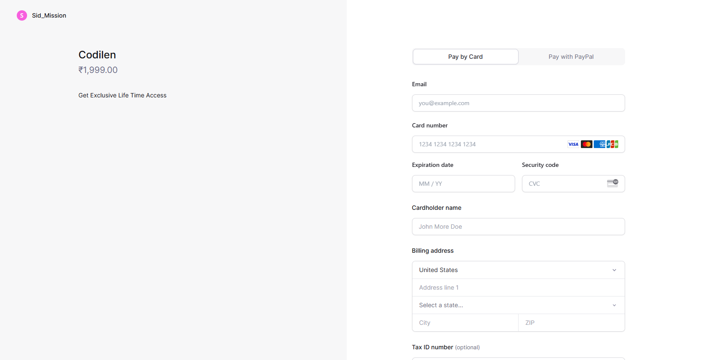

# 🧠 CodeCraft - Your Ultimate Online IDE

Welcome to **CodeCraft**, a powerful, modern online IDE built for developers who love speed, flexibility, and a great user experience. Whether you're learning to code or building full-stack apps, CodeCraft has everything you need to write, test, and share code in multiple languages—all from your browser.

---

## 🌐 Live at: https://code-craft-puce-gamma.vercel.app/

---

## 🚀 Tech Stack

CodeCraft is built with a modern and robust tech stack to ensure performance, scalability, and an exceptional user experience:

- **Next.js 15** – Fast, server-side rendering and routing
- **Convex** – Real-time database for storing code, history, and user data
- **Clerk** – Authentication and user management made easy
- **TypeScript** – Type-safe codebase for enhanced developer experience

---

## ✨ Features Overview

### 💻 Multi-language Online IDE
Write and execute code in **10+ popular languages** like:
- JavaScript
- Python
- C++
- Java
- Go
- Rust
- TypeScript
- C#
- Ruby
- Swift

Executions are powered by secure containerized environments using the **Piston API**.

---

### 🎨 5 Custom VSCode Themes
Customize your experience with beautifully crafted themes:
- VS Dark
- VS Light
- Github Dark
- Solarized Dark
- Monokai

---

### ✅ Smart Output Handling
Your output area will intelligently distinguish:
- ✅ Successful executions (green output)
- ❌ Errors or failed runs (red output)

---

### 💎 Flexible Pricing Plans
- **Free Plan**: Access to JavaScript and basic IDE features
- **Pro Plan**: Unlock all languages, advanced features, and premium support

Integrated with **LemonSqueezy** for secure payment handling.

---

### 🤝 Community Code Sharing
Share and save your code snippets or entire files with the community.

---

### 🔍 Advanced Search & Filtering
Find the right code snippet fast using:
- Language filters
- Keyword search
- Tag-based organization

---

### 👤 Personal Profile & Execution History
Each user gets a **profile page** that tracks:
- Languages used
- Past code executions
- Run time and status
- Favorite themes

---

### 📊 In-depth Statistics Dashboard
Visualize your coding journey with:
- Most used languages
- Daily/weekly activity
- Success vs error rates

---

### ⚙️ Customizable Font Size
Choose your preferred font size for a comfortable coding experience:
- Small
- Medium
- Large

---

### 🔗 Webhook Integration Support
Hook into your custom workflows!

- Triggers Auth Db after Clerk authentication .
- Trigger CI/CD jobs after code execution

---

---

## 💳 Payment Testing (For Developers)

You can test the payment flows using the following **Stripe test card** credentials:

- **Card Number:** `4242 4242 4242 4242`
- **Expiry Date:** `04/25` (or any future date)
- **CVV:** `424` (or any 3-digit number)
- **ZIP Code:** `12345` (or any 5-digit number)

> ⚠️ These are test credentials and will not trigger any actual payment.

Want to test failure cases or 3D Secure flows?  
Check out [Stripe's full list of test cards](https://stripe.com/docs/testing#international-cards).

---

## 🙌 Final Words

Thanks for checking out **CodeCraft**!  
We built this platform to make coding accessible, collaborative, and fun — right from your browser. Whether you're learning, experimenting, or building something amazing, CodeCraft has your back.

If you found this project useful or inspiring, feel free to ⭐ star the repo, share it with others, or contribute to its growth.

Feel free to raise PR and contribute to the project !!!

Happy coding with CodeCraft ! 💻🚀

